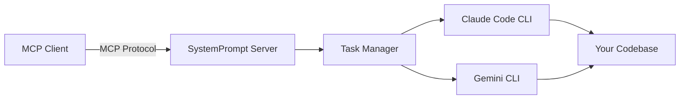

# SystemPrompt MCP Server - Coding Agent Orchestrator

An MCP (Model Context Protocol) server that orchestrates AI coding agents (Claude Code CLI and Gemini CLI) to perform complex coding tasks autonomously. This server acts as a bridge between MCP clients and AI coding tools, enabling automated code generation, refactoring, testing, and more.

## What is This?

The SystemPrompt MCP Server is a task orchestration system that:
- **Manages AI Coding Sessions**: Creates and controls Claude Code or Gemini CLI instances
- **Handles Complex Tasks**: Breaks down coding requests into manageable tasks with branch management
- **Provides MCP Interface**: Exposes tools through the standardized Model Context Protocol
- **Tracks Progress**: Maintains task state, logs, and session information
- **Supports Concurrent Operations**: Run multiple AI coding sessions simultaneously

## How It Works



1. **MCP Client** sends a request to create a task (e.g., "implement user authentication")
2. **SystemPrompt Server** creates a task and spawns the requested AI tool
3. **AI Tool** (Claude Code or Gemini CLI) executes in your project directory
4. **Task Manager** tracks progress and manages the session lifecycle
5. **Results** are streamed back to the MCP client in real-time

## Prerequisites

- Node.js 18+ 
- Docker and Docker Compose (for containerized deployment)
- API keys for the AI tools you want to use:
  - Anthropic API key (for Claude Code)
  - Google AI API key (for Gemini CLI)

## Installation

### Local Development

```bash
# Clone the repository
git clone https://github.com/systempromptio/systemprompt-mcp-server.git
cd systemprompt-mcp-server

# Install dependencies
npm install

# Copy environment template
cp .env.example .env

# Edit .env and add your API keys and project path
nano .env

# Build the TypeScript project
npm run build

# Start the server
node build/index.js
```

### Docker Deployment

```bash
# Build and run with Docker
docker-compose up -d

# View logs
docker-compose logs -f

# Stop server
docker-compose down
```

## Configuration

### Environment Variables

Create a `.env` file with the following configuration:

```env
# API Keys (required)
ANTHROPIC_API_KEY=your_anthropic_api_key_here
GEMINI_API_KEY=your_gemini_api_key_here

# Project Configuration
PROJECT_ROOT=/path/to/your/project  # Where AI tools will execute
PORT=3000                           # Server port (optional)

# Optional Configuration
JWT_SECRET=your_jwt_secret_here     # For future auth features
STATE_PATH=/data/state              # State persistence location
```

### MCP Client Configuration

Add the server to your MCP client configuration:

#### Claude Desktop (claude_desktop_config.json)

```json
{
  "mcpServers": {
    "systemprompt-coding": {
      "command": "node",
      "args": ["/path/to/systemprompt-mcp-server/build/index.js"]
    }
  }
}
```

#### Cline/Other MCP Clients

```json
{
  "systemprompt-coding": {
    "command": "node",
    "args": ["/path/to/systemprompt-mcp-server/build/index.js"],
    "env": {
      "ANTHROPIC_API_KEY": "your_key",
      "GEMINI_API_KEY": "your_key",
      "PROJECT_ROOT": "/path/to/your/project"
    }
  }
}
```

## Tools Overview

The SystemPrompt MCP Server provides 7 core tools for managing AI coding tasks:

| Tool | Purpose | When to Use |
|------|---------|-------------|
| `create_task` | Start a new AI coding session | Beginning any coding task |
| `update_task` | Send additional instructions | Adding requirements mid-task |
| `end_task` | Complete and clean up a task | Task is done or needs to stop |
| `report_task` | Generate task reports | Review progress or outcomes |
| `check_status` | Verify system readiness | Before starting tasks |
| `update_stats` | Get system statistics | Monitoring active work |
| `clean_state` | Clean up old tasks/sessions | Maintenance and cleanup |

## Core Tools

### 1. create_task

Creates a new coding task and immediately starts the AI agent to work on it.

```typescript
{
  "title": "Add user authentication",
  "tool": "CLAUDECODE",  // or "GEMINICLI"
  "instructions": "Implement JWT-based authentication with login and signup endpoints",
  "branch": "feature/auth"
}
```

**Parameters:**
- `title` (required): Short, descriptive title for the task
- `tool` (required): Which AI tool to use (`"CLAUDECODE"` or `"GEMINICLI"`)
- `instructions` (required): Detailed instructions for what needs to be done
- `branch` (required): Git branch name (will be created if it doesn't exist)

**Returns:** Task ID, session ID, and initial status

### 2. update_task

Send additional instructions to an active AI process.

```typescript
{
  "process": "session_abc123",
  "instructions": "Add password reset functionality"
}
```

**Parameters:**
- `process` (required): The process ID (session ID) of the active AI agent
- `instructions` (required): New instructions to send to the AI agent

### 3. end_task

End a task, optionally sending a final command, and clean up the AI session.

```typescript
{
  "task_id": "task_abc123",
  "status": "completed",  // or "failed", "cancelled"
  "summary": "Successfully implemented authentication",
  "final_command": "npm test",
  "generate_report": true,
  "cleanup": {
    "save_session_logs": true,
    "save_code_changes": true,
    "compress_context": false
  }
}
```

**Parameters:**
- `task_id` (required): The ID of the task to end
- `status` (required): Final status (`"completed"`, `"failed"`, or `"cancelled"`)
- `final_command` (optional): Command to run before ending
- `summary` (optional): Summary of what was accomplished
- `result` (optional): Any final result data to store
- `generate_report` (optional, default: true): Generate a final report
- `cleanup` (optional): Cleanup options for logs and context

### 4. report_task

Generate reports on task progress and outcomes.

```typescript
{
  "task_ids": ["task_abc123", "task_def456"],  // empty for all tasks
  "report_type": "detailed",  // "summary", "detailed", or "progress"
  "format": "markdown"  // or "json"
}
```

**Parameters:**
- `task_ids` (optional): List of specific task IDs (empty for all tasks)
- `report_type` (optional, default: "summary"): Level of detail
- `format` (optional, default: "json"): Output format

### 5. check_status

Check the status of Claude Code SDK and Gemini CLI availability.

```typescript
{
  "test_sessions": true,
  "verbose": false
}
```

**Parameters:**
- `test_sessions` (optional, default: true): Test creating sessions
- `verbose` (optional, default: false): Include detailed diagnostics

**Returns:** Service availability, API key status, and system configuration

### 6. update_stats

Get current statistics on tasks and active sessions.

```typescript
{
  "include_tasks": true,
  "include_sessions": true
}
```

**Parameters:**
- `include_tasks` (optional, default: true): Include task statistics
- `include_sessions` (optional, default: true): Include session statistics

### 7. clean_state

Clean up system state by removing completed tasks and inactive sessions.

```typescript
{
  "clean_tasks": true,
  "clean_sessions": true,
  "keep_recent": true,
  "force": false,
  "dry_run": false
}
```

**Parameters:**
- `clean_tasks` (optional, default: true): Remove completed/failed tasks
- `clean_sessions` (optional, default: true): Terminate inactive sessions
- `keep_recent` (optional, default: true): Keep items from last 24 hours
- `force` (optional, default: false): Clean everything regardless of status
- `dry_run` (optional, default: false): Preview what would be cleaned

## Usage Examples

### Example 1: Implementing a New Feature

```javascript
// Create a task to implement a shopping cart feature
const response = await mcp.call('create_task', {
  title: 'Implement shopping cart',
  tool: 'CLAUDECODE',
  instructions: `
    Create a shopping cart feature with the following:
    1. Add to cart functionality
    2. Update quantities
    3. Remove items
    4. Calculate totals with tax
    5. Persist cart in localStorage
    6. Add unit tests
  `,
  branch: 'feature/shopping-cart'
});

// Task starts immediately and Claude Code begins implementation
// Monitor progress through the task_id returned
```

### Example 2: Refactoring Code

```javascript
// Create a refactoring task
const response = await mcp.call('create_task', {
  title: 'Refactor user service',
  tool: 'GEMINICLI',
  instructions: `
    Refactor the user service to:
    - Use dependency injection
    - Add proper error handling
    - Implement repository pattern
    - Add comprehensive logging
    - Ensure all tests still pass
  `,
  branch: 'refactor/user-service'
});
```

### Example 3: Bug Fixing

```javascript
// Create a bug fix task
const response = await mcp.call('create_task', {
  title: 'Fix authentication bug',
  tool: 'CLAUDECODE',
  instructions: `
    Debug and fix the issue where users can't log in after password reset.
    Check the password hashing logic and session management.
    Add tests to prevent regression.
  `,
  branch: 'bugfix/auth-after-reset'
});

// Later, add more context if needed
await mcp.call('update_task', {
  process: response.result.session_id,
  instructions: 'Also check if the reset token is being properly invalidated'
});
```

### Example 4: Task Management

```javascript
// Check system status first
const status = await mcp.call('check_status', {
  verbose: true
});

// Get statistics on all tasks
const stats = await mcp.call('update_stats', {
  include_tasks: true,
  include_sessions: true
});

// Generate a detailed report for specific tasks
const report = await mcp.call('report_task', {
  task_ids: ['task_abc123', 'task_def456'],
  report_type: 'detailed',
  format: 'markdown'
});

// Clean up old completed tasks
const cleanup = await mcp.call('clean_state', {
  clean_tasks: true,
  clean_sessions: true,
  keep_recent: true,
  dry_run: true  // Preview first
});

// End a task with final testing
const result = await mcp.call('end_task', {
  task_id: 'task_abc123',
  status: 'completed',
  final_command: 'npm test',
  summary: 'Successfully implemented user authentication with JWT',
  cleanup: {
    save_session_logs: true,
    save_code_changes: true
  }
});
```

## How Tasks Work

1. **Task Creation**: When you create a task, the server:
   - Generates a unique task ID
   - Creates/switches to the specified Git branch
   - Spawns the selected AI tool (Claude Code or Gemini CLI)
   - Sends your instructions to the AI

2. **Task Execution**: The AI tool:
   - Analyzes your codebase
   - Plans the implementation
   - Makes changes to files
   - Runs tests if requested
   - Provides real-time feedback

3. **Task Completion**: When finished:
   - All changes remain in the Git branch
   - Logs are saved for review
   - Session resources are cleaned up
   - You can review and merge the changes

## Best Practices

1. **Clear Instructions**: Provide detailed, specific instructions for best results
2. **Use Branches**: Always specify a branch to keep changes isolated
3. **One Task Per Feature**: Break complex features into multiple tasks
4. **Include Tests**: Ask the AI to write tests for code changes
5. **Review Changes**: Always review AI-generated code before merging

## Architecture

```
systemprompt-mcp-server/
├── src/
│   ├── handlers/          # MCP request handlers
│   ├── services/          # Core services (task, agent management)
│   ├── types/             # TypeScript type definitions
│   └── utils/             # Utility functions
├── docker-compose.yml     # Docker configuration
├── Dockerfile            # Container definition
└── .env.example          # Environment template
```

## Advanced Features

### State Persistence
Tasks and their state are persisted to disk, surviving server restarts.

### Concurrent Sessions
Run multiple AI coding sessions simultaneously on different tasks.

### Git Integration
Automatic branch creation and management for each task.

### Real-time Streaming
Get live updates as the AI tools work on your code.

## Troubleshooting

### AI Tool Not Starting
- Ensure API keys are correctly set in `.env`
- Check that `PROJECT_ROOT` points to a valid directory
- Verify Docker is running (for containerized deployment)

### Permission Issues
- Ensure the server has write access to `PROJECT_ROOT`
- Check Docker volume permissions if using containers

### Git Branch Issues
- Ensure your project is a Git repository
- Commit or stash changes before creating tasks

## Security Considerations

- **API Keys**: Store securely, never commit to version control
- **Project Access**: The server has full access to `PROJECT_ROOT`
- **Network**: Use HTTPS in production environments
- **Isolation**: Run in containers for better isolation

## Contributing

Contributions are welcome! Please read our contributing guidelines and submit PRs.

## License

MIT License - see LICENSE file for details

## Support

- Issues: [GitHub Issues](https://github.com/systempromptio/systemprompt-mcp-server/issues)
- Discussions: [GitHub Discussions](https://github.com/systempromptio/systemprompt-mcp-server/discussions)
- Documentation: [SystemPrompt Docs](https://systemprompt.io)